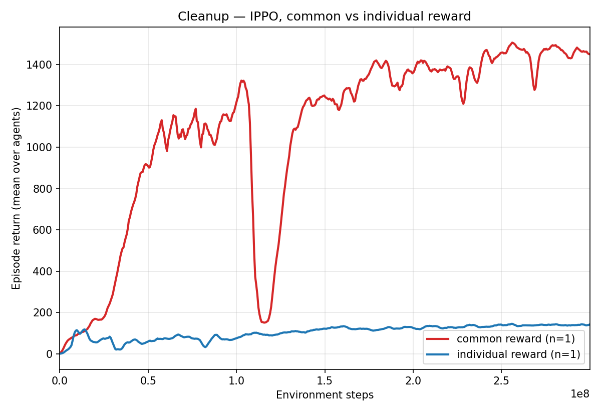
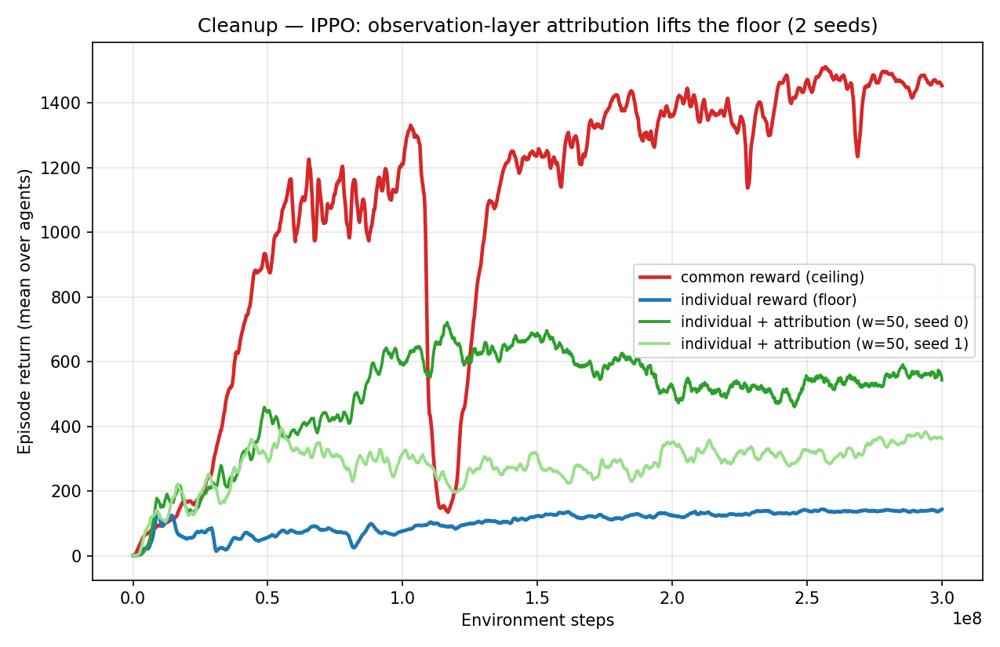
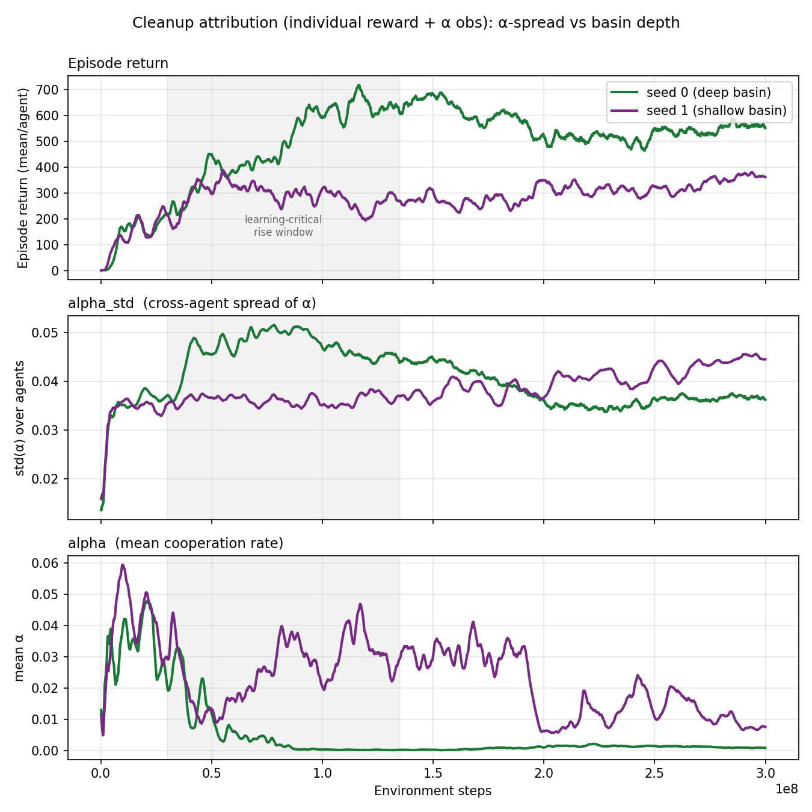
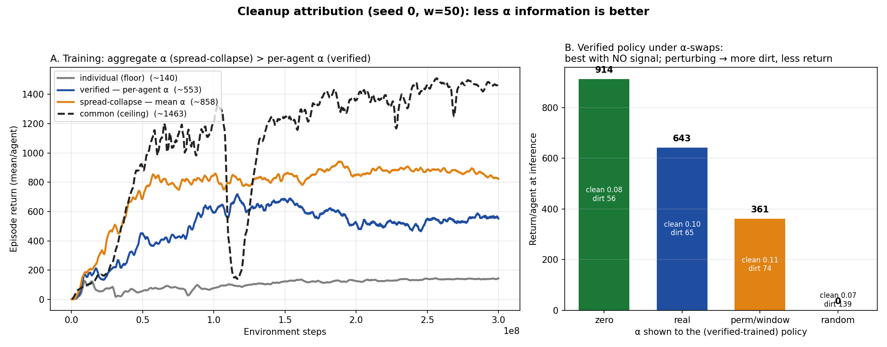
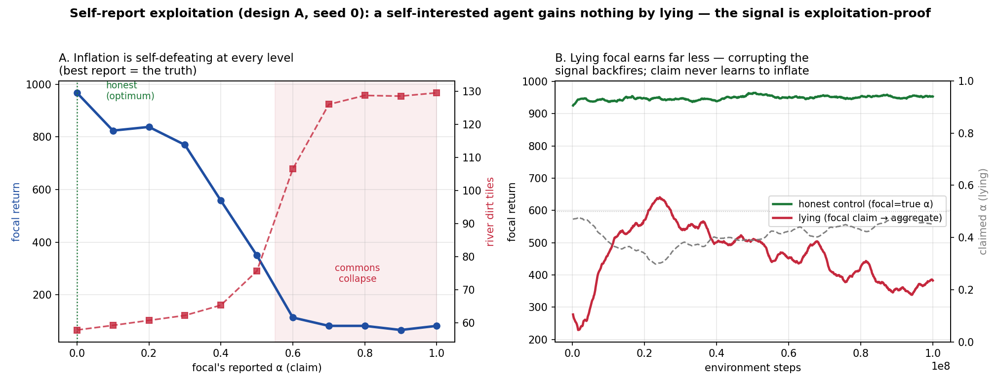
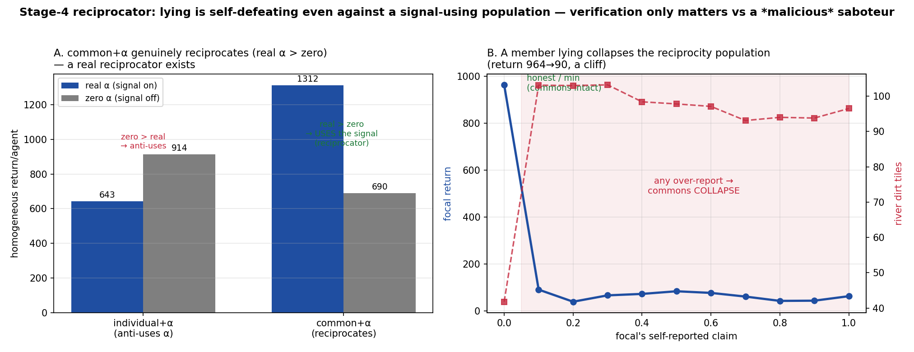
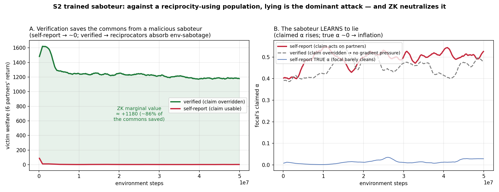
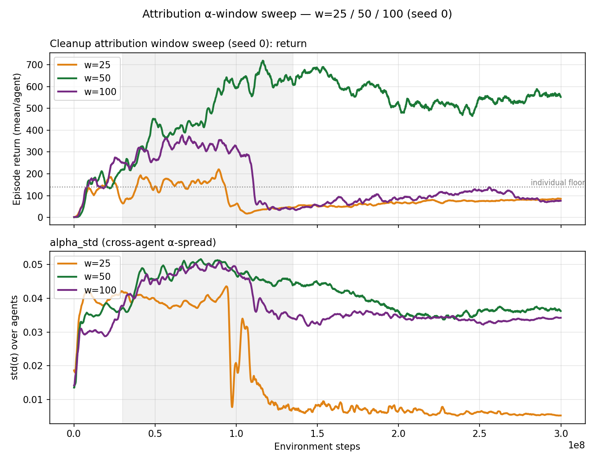
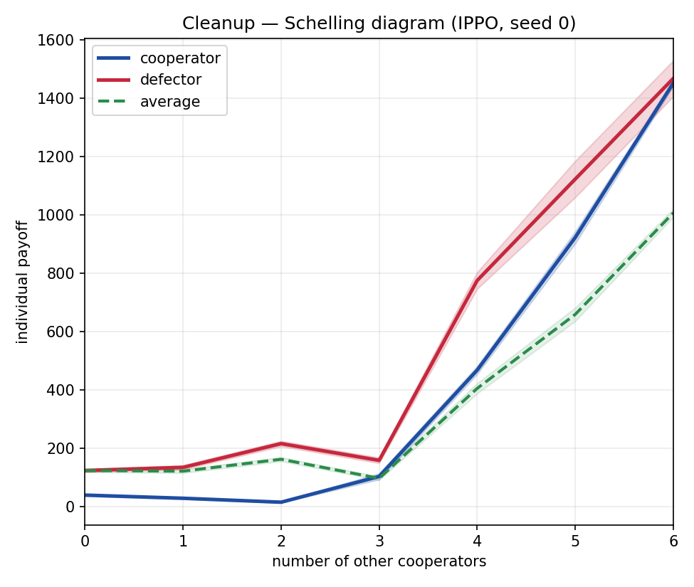
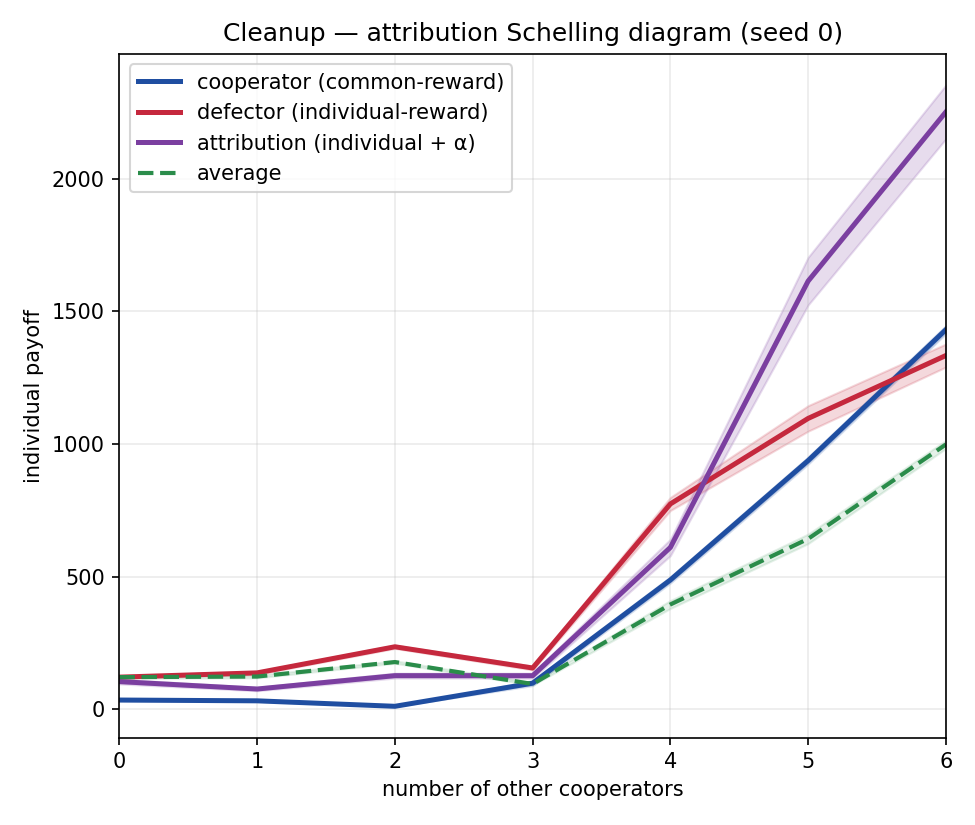

# Cleanup — IPPO Baseline + Attribution Design

> **Status (2026-06-01):** Cleanup IPPO baselines reproduced (common ≫
> individual, 10.5× gap). Observation-layer attribution (per-peer α
> injection via `AttributionWrapper`, individual reward untouched) **lifts
> the floor: 2 seeds plateau at ~358 and ~553 vs the individual floor of
> ~140 — ~24% of the floor→ceiling gap closed, replicated across seeds.**
> Positive result for the observation-layer thesis (see "Attribution
> result"). **Mechanism + behaviour probes (2026-05-29):** α-*spread*
> predicts *which basin a seed reaches* during the learning-critical rise
> (see "Mechanism"); but Schelling co-play diagrams show the lift is a
> **population-equilibrium** effect — a *lone* attribution agent dropped
> among fixed strangers free-rides rather than reciprocating (see "Schelling
> diagrams"). **Window sweep (2026-06-01):** holding seed 0 fixed, **w=50 is
> a sharp optimum** — both w=25 and w=100 collapse at ~1e8 and end at the
> floor (see "Window sweep"); seed-1 confirmation pending. **α-usage ablation:**
> the policy reads α's cross-agent structure (shuffling peers costs ~44%) but is
> *better off with α≡0* (zero 914 > real 643) — the gap is coordination
> degradation, not free-riding; α is a training-time scaffold the converged policy
> over-responds to (see "α-usage ablation"). **Causal test (2026-06-08):**
> forcing α's cross-agent spread to zero (aggregate-only) plateaus *higher* than
> the per-agent signal (858 vs 553, seed 0) — the per-agent breakdown hurts; the
> aggregate cooperation level is the useful signal, and α-spread was correlational
> not causal. (The ZK verification target shrinks to one scalar — the aggregate.)
> **Stage-4 result (2026-06-08):** verified-vs-self-reported tested as a frozen-
> partner best-response — **lying is self-defeating**: inflating the aggregate makes
> partners coordinate worse, so a free-riding focal's *own* return more than halves
> (954→368) and the best report is the truth (no sweet spot). So **verification
> earns nothing *here*** — the signal is exploitation-proof by the policy's response,
> not by crypto (see "Stage-4 result"). **Reciprocator extension (2026-06-09):** a
> *learned* reciprocator exists (common+α uses α positively: real 1312 > zero 690),
> and lying is *even more* self-defeating against it — a member's over-report
> *collapses* the commons (964→90, a cliff). So across both regimes + both report
> directions, honesty dominates → ZK adds nothing **vs a self-interested agent**.
> **The exception — now tested (Stage-4 sabotage):** a **malicious saboteur**
> (reward = −victim welfare) *trained* against the reciprocator population **learns to
> lie** and drives victim welfare to ~0; with the claim **verified** it can only
> env-sabotage (which the reciprocators absorb) → welfare stays ~1180. So **ZK saves
> ~86% of the commons (+1180)** against a malicious agent — verification's value is
> real but concentrated in the **malicious × signal-reliant × low-direct-leverage**
> regime (see "Stage-4 sabotage").

## TL;DR

On Cleanup, the SocialJax paper shows common-reward IPPO **dramatically
outperforms** individual-reward IPPO — the opposite direction from Territory.
We reproduced this: common plateau **1463** vs individual **140** at 3e8
timesteps (PS=False), a 10.5× gap.

**Headline result:** observation-layer attribution (inject per-peer
cooperation rate α into observations, leave reward individual) lifts
individual-reward IPPO from the ~140 floor to ~358–553 across 2 seeds
(~24% of the floor→ceiling gap), **without touching the reward** — the
on-thesis design (observation layer, reward untouched) that Territory's
reward-layer Predicate A wasn't.

**What the lift is (mechanism probes, 2026-05-29):** the lift is an
**equilibrium-selection** effect, not a transferable reciprocal disposition.
Higher cross-agent α-*spread* during the learning-critical rise steers a seed
into a deeper cooperative basin (see "Mechanism"), but a *single* attribution
agent co-played among fixed cooperators/defectors still free-rides — it never
cleans (see "Schelling diagrams"). Attribution selected a better population
equilibrium; it did not hand each agent a portable tit-for-tat.

Cleanup and Territory need **opposite attribution designs**, and that's the
whole point:

| | Cleanup | Territory |
|---|---|---|
| Problem type | **incentive** (cleaning is costly, benefits others → free-riding) | credit assignment (can't tell whose action earned the shared reward) |
| Right mechanism | **reciprocity** — see who cooperates, condition on it | reward decomposition — pay agents for their own contribution |
| Attribution layer | **observation** (information) | reward (gradient) |
| Per-agent signal? | yes (own cleaning rate) | no (defense depends on others) |
| Predicate | v2 beam: fired zap_clean AND beam hit dirt | claim + defense (zap near a claim) |

For Cleanup, reward stays **individual** (the failing baseline) and we inject
a per-peer cooperation-rate vector **α** into observations. The hypothesis:
reciprocity lifts individual-reward IPPO off its floor toward the
common-reward ceiling.

## Baseline reproduction

`modal run cleanup/modal_cleanup_baseline.py --mode calibration
--reward-mode {common,individual} --total-timesteps 300000000
--no-parameter-sharing --num-envs 128 --timeout-minutes 0` (A100-80GB).

Config matches the pre-fix style we used for Territory: PS=False,
NUM_ENVS=128. Cleanup defaults: NUM_AGENTS=7, NUM_STEPS=1000.

Both arms completed the full 3e8 despite multiple Modal spot-instance
preemptions (common 1×, individual 3×). Each preemption-restart preserved
the partial run as a `*.backup_<ts>` dir (orchestrator renames rather than
wipes — see the "preserve on retry" change).

| Arm | plateau (final 10%) | peak | env_step |
|---|---|---|---|
| common | **1463.26** | 1532.13 | 3e8 (100%) |
| individual | **139.65** | 157.25 | 3e8 (100%) |

**Gap: 10.5×.** Reproduces the paper's Cleanup Figure 3 (common ≫
individual). Our individual plateau (~140) is higher than the paper's ~10,
plausibly a reward-accounting or config difference (NUM_ENVS 128 vs 256),
but the qualitative result — common dominates individual by an order of
magnitude — holds strongly.



**Notable:** the common arm has a sharp collapse around env_step 1.1e8
(plateau ~1320 → ~150) then fully recovers to an even higher plateau. This
is a known Cleanup IPPO instability — the shared-reward policy temporarily
loses coordination, then re-discovers it. Reassuring that it recovers.

## Why Cleanup needs observation-layer attribution (not Territory's reward-layer)

Territory's problem is **credit assignment**: the shared reward can't be
traced to whose action earned it, so the fix is reward-layer decomposition
(pay each agent for their own contribution). That's what Predicate A did —
and it's a *reward* intervention.

Cleanup's problem is different. Each agent's individual reward is already
cleanly its own (apples it personally harvested). There's no
credit-assignment ambiguity. The failure is an **incentive** problem:
cleaning dirt is individually costly (you forgo harvesting while you clean)
but benefits everyone (cleaner river → more apples regrow). Independent
selfish learners free-ride: nobody cleans, the river clogs, apples stop
growing, everyone gets ~0.

The tool for incentive problems is **reciprocity** — conditional
cooperation ("I clean as long as others clean"). Reciprocity requires
*information*: each agent must be able to *see* whether peers are
cooperating, in order to condition its own behavior on that. So the
intervention is **observation-layer**: inject the information, leave the
reward untouched.

This also matches the credit-assignment caveat from the project notes:
observation injection does NOT fix credit assignment (which is why Territory
needed reward-layer). But Cleanup's problem isn't credit assignment — so
observation-layer is the correct match.

## Attribution design (Stage 3 — oracle α)

### Predicate: v2 beam (per-agent, observation-compatible)

```
e_k(i) = 1  iff  action_i == zap_clean  AND  agent i's beam covers ≥1 dirt tile
```

Implemented and unit-tested as `zkattribution.predicate.cleanup_events_batch`
(see `docs/predicate.md`). Per-agent (computable from agent i's own
trajectory + tiles in view), not confounded by pollution spawning (unlike the
v1 global-delta variant). Returns `(num_agents,)` int8 per step.

**α** = fraction of the last N steps an agent registered a cleanup event.
Per-agent, in [0, 1].

### Wrapper: `AttributionWrapper` (Stage 3)

`zkattribution.wrappers.AttributionWrapper` (see `docs/stage3_design.md`):

- Maintains a ring buffer of the last `window_size` steps of per-agent events.
- At each window boundary, recomputes α (per-agent mean over the window).
- Broadcasts α as `num_agents` extra constant channels onto each agent's obs:
  `(H, W, C) → (H, W, C + num_agents)`. Every agent sees the full α vector
  (own + peers).
- α is constant *within* a window; agents see the *previous* window's
  cooperation rates. First window (steps 0..N-1): α = zeros.
- The CNN's first conv layer auto-infers `in_channels` from the augmented
  obs shape at init — no architecture change needed.

### Reward: individual (unchanged)

We do NOT redistribute reward. Reward stays `shared_rewards=False`
(individual — the failing baseline). Only the observation is augmented.

### Verification (done, no Modal needed)

Confirmed locally with the Cleanup env:

- `AttributionWrapper(clean_up).observation_space()` reports
  `(11, 11, 26)` = raw `(11, 11, 19)` + 7 agent channels. ✓
- reset/step run; α starts at zeros, updates at window boundaries. ✓
- Predicate is strict: at random initial agent positions, 0 events fire
  (beams don't hit dirt) — no false positives. Events only register when an
  agent actually navigates to the river and fires a clean beam onto dirt.
  This is the correct, un-confounded behavior. ✓

### Implementation wiring

`cleanup/modal_cleanup_baseline.py`:

- `_patch_socialjax_ippo_cleanup_attribution()` — idempotent runtime patch
  that inserts `env = AttributionWrapper(env, predicate=cleanup_events_batch,
  window_size=N)` into `make_train` (the training path only — `get_rollout`
  and `evaluate` stay bare). Applied in-container, never edits the submodule.
- CLI flags: `--attribution`, `--attribution-window N`.
- Passes `+ATTRIBUTION=true` and `+ATTRIBUTION_WINDOW=N` as Hydra overrides;
  the patched `make_train` reads them via `config.get(...)`.
- Attribution runs land in dirs tagged
  `ippo_cleanup_<mode>_t<T>_ps0_e<envs>_attrV2_w<N>_seed<seed>`.

## Experiment plan

**Arm:** individual-reward IPPO + α-in-observation.
**Baseline:** the completed individual-reward IPPO (plateau ~140, the floor).
**Ceiling:** the completed common-reward IPPO (plateau ~1463).

```bash
modal run cleanup/modal_cleanup_baseline.py \
  --mode calibration --reward-mode individual \
  --total-timesteps 300000000 --no-parameter-sharing --num-envs 128 \
  --timeout-minutes 0 --attribution --attribution-window 50
```

**Question:** does reciprocity (α-in-obs) lift individual-reward IPPO off the
~140 floor toward the ~1463 ceiling?

### Design knobs

- **Window N:** MAPPO used N=100, α sat near 0.04 (low-variance). Starting
  with **N=50** — more responsive without being pure noise. If α[i] ≈ α[j]
  across agents (no spread), the per-peer vector is uninformative regardless
  of horizon — worth logging α distribution at window boundaries to check.
- **Own vs peer α:** include the full vector (own + peers); the policy can
  learn to attend to peers. Mask own-α only if it trivially over-fits.
- **First window:** zeros until the first window completes.

### The honest open question

The mechanism (reciprocity) is the right tool for Cleanup's incentive
problem, but **whether IPPO discovers it within budget is genuinely
uncertain**. Cleaning is individually costly; seeing peers clean only makes
your cleaning worthwhile if the agents learn a reciprocal strategy ("I clean
→ peers keep cleaning → apples regrow → I benefit later"). That's a
multi-step, long-horizon causal chain IPPO must learn from the α signal.

- **Why it might work:** α is the only coordination cue available to
  independent learners; conditional-cooperation strategies become learnable
  once peer cooperation is observable.
- **Why it might not:** the reciprocal dynamics may be too long-horizon for
  IPPO to discover, and the signal may stay too sparse to bootstrap.

Both outcomes are informative. One arm (single seed) is enough to see whether
the floor lifts; if it does, scale to multiple seeds.

### Diagnostics to log

- α statistics (per-agent mean over the window) — confirm α actually moves
  and spreads across agents.
- If returns stay flat, check policy gradient w.r.t. α: grad ≈ 0 → policy
  ignores α (discovery didn't fire); grad ≠ 0 but flat returns → policy
  conditions on α but conditioning isn't producing useful behavior (different
  failure mode).

## Attribution result (w=50, 2 seeds) — POSITIVE

Ran the attribution arm — individual reward + α-in-observation, window 50 —
at the same config as the baselines (IPPO, 3e8, PS=False, NUM_ENVS=128,
A100-80GB), two seeds:

```bash
modal run cleanup/modal_cleanup_baseline.py \
  --mode calibration --reward-mode individual --seed {0,1} \
  --total-timesteps 300000000 --no-parameter-sharing --num-envs 128 \
  --timeout-minutes 0 --attribution --attribution-window 50
```

Both seeds trained the full 3e8 (verified: `max env_step` = 2.999e8 = 100%).
Note: both subprocesses exited non-zero due to a crash in the *post-training*
eval/GIF phase (a `KeyboardInterrupt` in a wandb CpuCallback), so
`RUN_COMPLETE` wasn't written — but the **training data is complete and
valid**. (Follow-up: treat "trained to TOTAL_TIMESTEPS but eval crashed" as
success in the orchestrator so this doesn't read as a failure.)

| Arm | plateau (final 10%) | peak | gap closure (floor→ceiling) |
|---|---|---|---|
| common reward (ceiling) | 1463 | 1532 | 100% |
| **attribution seed 0** | **552.68** | 765.56 | **31%** |
| **attribution seed 1** | **357.81** | 413.92 | **16%** |
| **attribution mean** | **~455** | — | **~24%** |
| individual reward (floor) | 140 | 157 | 0% |



**Interpretation.** Both attribution seeds separate from the individual floor
early (~env_step 2-3e7) and hold a clear lead through the full 3e8. Neither
reaches the common-reward ceiling, but both unambiguously lift off the floor.
Observation-layer attribution does what the thesis predicts for Cleanup:
giving independent learners visibility into peer cooperation rates lets them
condition on it (reciprocity) and cooperate more than bare individual reward —
**without touching the reward**. This is the on-thesis design that Territory's
reward-layer Predicate A wasn't.

**Caveats / next steps.**

- Partial closure (~24%): reciprocity helps but doesn't fully solve Cleanup's
  incentive problem at w=50. **Window sweep done (seed 0 — see "Window sweep"):**
  w=50 is a sharp optimum; both w=25 and w=100 collapse to the floor at ~1e8.
  Seed-1 confirmation pending.
- Seed variance is non-trivial (358 vs 553). More seeds would tighten the
  estimate.
- Mechanism now partially probed (see "Mechanism" and "Schelling diagrams"
  below): α-spread predicts which basin a seed reaches, and co-play shows the
  cooperation is a population-equilibrium effect rather than a transferable
  reciprocal disposition. An α-usage ablation (see "α-usage ablation") shows the
  policy *depends* on α (random α → 0 return) yet does best with α≡0 — α-dependent,
  but not informative-reciprocity.

## Mechanism: α-spread predicts which basin a seed reaches

Both attribution runs logged `alpha` (grand-mean cooperation rate) and
`alpha_std` (cross-agent std of α, averaged over the rollout and the 128
parallel envs) at every update step, so the mechanism can be probed
retroactively — no re-run.

**Hypothesis.** The deeper cooperative basin is reached when the per-peer α
signal carries *more cross-agent information* — operationalised as a higher
`alpha_std`. (If every agent has the same α, the per-peer vector is
uninformative, regardless of horizon.) Seed 0 reached the deeper basin (plateau
553) than seed 1 (358), so seed 0 should show higher α-spread.

**Result — holds during the rise, flips at convergence:**

| window | seed 0 `alpha_std` | seed 1 `alpha_std` | s0 − s1 |
|---|---|---|---|
| learning-critical rise (3e7–1.35e8) | **0.0468** | 0.0361 | **+0.0107** |
| plateau (final ≥70% of run) | 0.0358 | 0.0422 | −0.0064 |
| whole run | 0.0407 | 0.0382 | +0.0025 |

During the **rise** — the window where seed 0 climbs to its basin — seed 0's
α-spread is ~30% higher than seed 1's, exactly as predicted: more cross-agent
signal → deeper basin reached. But the ranking **flips in the plateau** (seed 0
lower), with the smoothed crossover at env_step ≈ **1.9e8**.

**Refined claim.** α-spread predicts *which basin is reached* (a property of
the learning-critical transient), not *which is occupied at convergence* (the
plateau ranking inverts). This reads as **equilibrium selection**: richer
peer-cooperation signal during learning steers the population into a deeper
cooperative basin; once there, the basin sustains itself with less α-spread.
It is the population-level counterpart of the Schelling co-play finding below —
both say attribution acts on the *equilibrium the group settles into*, not on a
portable individual strategy.

**Causal update (see "Causal test" below).** This spread↔basin link is only
*correlational*. A causal test — training with the cross-agent spread forced to
zero — plateaus *higher*, not lower (858 vs 553). So α-spread predicts *which*
basin a seed reaches but is **not** the causal driver; the aggregate α *level*
is. Read this section as correlational.

**Caveat — α level is confounded.** A *low* α at *high* return partly reflects
a clean river (little dirt left for a clean-beam to hit), not low cooperation.
So we read the cross-agent *spread* of α (an information measure), not its
absolute level, as the mechanism signal. The same confound resurfaces in the
Schelling cleanrate below.



## α-usage ablation (w=50 seed 0) — uses α's structure, but is *better off without it*

Does the trained policy actually *use* α? We run the homogeneous all-attr
population (the training regime) in the wrapper and swap the α the policy sees at
inference — env dynamics are identical (α never affects transitions), only the
policy's view changes. `scripts/ablate_alpha_cleanup.py`, 24 episodes:

| α at inference | return/agent | clean-action rate | mean dirt tiles |
|---|---|---|---|
| **zero** (α ≡ 0) | **914 ± 14** | 0.078 | 55.8 |
| **real** (wrapper's true α) | 643 ± 23 | 0.100 | 64.6 |
| perm/step (shuffle peers every step) | 385 ± 19 | 0.105 | 72.9 |
| perm/window (shuffle peers once per 50-step window) | 361 ± 24 | 0.107 | 73.5 |
| random U[0,1] | 0 | 0.035 | 138.9 |
| random U[0,0.1] (magnitude-matched) | 0 | 0.066 | 138.8 |

(real ≈ the ~553 training plateau — sane.) Four reads:

- **Not inert / not a regularizer.** Random α **collapses return to 0** — the
  channels are load-bearing.
- **Not a magnitude artifact.** Magnitude-matched noise (U[0,0.1], same scale as real
  α ~0.005–0.05) collapses to 0 *just like* U[0,1]. So the policy is sensitive to α's
  *values/structure*, not merely its scale — it lives on a manifold of plausible α
  patterns and off-manifold values are fatal.
- **It uses cross-agent information.** Permuting *which peer* has which α costs ~44%
  (643→361), and the **cadence-matched** shuffle (perm/window — once per 50 steps,
  no extra temporal jitter) hurts as much as the per-step one. So the drop is the
  cross-agent shuffle itself, not jitter: the policy reads α's peer-identity structure.
- **Yet it's better off without α.** zero (914) > real (643): at convergence the
  static policy does *best with no signal*.

**Why zero > real — coordination degradation, not exploitation.** We tested the
"more info lets agents free-ride/exploit" hypothesis directly via the behavioural
columns. It predicts real α → *less* cleaning. The data shows the **opposite**:
under real α agents clean **more** (0.100 vs 0.078) yet the river is **dirtier**
(64.6 vs 55.8) and they earn **less**. So in the *homogeneous* population real α
isn't free-riding — it's **coordination degradation**: a shared signal all 7 agents
react to identically → herding / poor spatial coverage → more (futile) cleaning,
dirtier river, fewer apples. The policy's best regime is genuinely **α≡0** (least
effort, cleanest river, most apples); every off-real perturbation raises both
clean-action rate and dirt while lowering return.

**Population-dependence — exploitation *does* appear with a sucker present.** This
is no contradiction of the Schelling co-play, where a *lone* attribution agent among
fixed cooperators free-rides (cleanrate ≈ 0) and out-earns a defector. So: **more
info → exploitation when there are cooperators to exploit (mixed population); among
identical agents, more info just degrades coordination.** Both fit the headline
mechanism — **α is a training-time scaffold** (it steers the population into the
basin; see "Mechanism") that the converged policy over-responds to at inference.

## Causal test: aggregate α beats per-agent α (spread-collapse, seed 0)

The "Mechanism" section is *correlational* — across two seeds, higher α-spread
during the rise coincided with the deeper basin. To test **causality** we trained
an arm where the α the policy observes is forced to **zero cross-agent spread**:
the wrapper broadcasts the *grand-mean* α to all peers (still honest — the
per-agent true α is unchanged in state/logs; the policy is just denied the
breakdown). `AttributionWrapper(collapse_spread=True)`, wired via `--collapse-spread`,
same seed/config as verified:

```bash
modal run --detach cleanup/modal_cleanup_baseline.py \
  --mode calibration --reward-mode individual --seed 0 \
  --total-timesteps 300000000 --no-parameter-sharing --num-envs 128 \
  --timeout-minutes 0 --attribution --attribution-window 50 --collapse-spread
```

**Result — collapsing the spread *helps*:**

| arm (seed 0, w=50) | α the policy sees | plateau | peak |
|---|---|---|---|
| individual (floor) | none (19ch) | 140 | — |
| **verified** | full **per-agent** vector (26ch) | **553** | 766 |
| **spread-collapse** | **aggregate** (mean) only (26ch) | **858** | 989 |
| common (ceiling) | — (shared reward) | 1463 | — |



- **α-spread is *not* causally necessary.** Forcing spread → 0 didn't push toward
  the floor; it plateaued **higher** than verified (858 vs 553, same seed; the true
  α-spread was still ~0.054, just hidden from the policy).
- **Aggregate α beats per-agent α.** The clean 26ch-vs-26ch comparison (verified
  553 vs spread-collapse 858) isolates per-agent-vs-aggregate: the **per-agent
  breakdown is net harmful** (~−305). The useful signal is the *aggregate
  cooperation level* ("is the group cleaning?"), not *who*.
- **Agrees with the α-usage ablation** ("less α information is better"): per-agent
  detail induces herding / miscoordination (more but futile cleaning, dirtier
  river) at inference *and* now in training.
- **Reframes the mechanism:** α-spread was a *correlate* of which basin a seed
  reached, not the causal driver — the aggregate *level* drives the lift. **n=1
  seed; seed-1 spread-collapse confirmation pending** before this is firm.

### What this means for ZK / Stage-4 (reframed around the aggregate)

Tier-1 didn't touch verification — both arms fed **oracle** α; the only variable
was per-agent vs aggregate. So aggregate-being-better does **not** weaken the ZK
case:

- The aggregate is `mean(αᵢ)`, so if agents **self-report** their αᵢ, it becomes
  `mean(claimedᵢ)` — any agent inflating its claim **inflates the aggregate**. A
  self-reported aggregate is just as gameable (claim you're cleaning so peers keep
  cleaning while you free-ride).
- What changes is the **verification target**: prove **one scalar** (the true
  aggregate cooperation count over the window) instead of a 7-element vector — a
  *simpler, cheaper* ZK circuit. Good for the ZK story, not bad.

**Stage-4, reframed:** verified-aggregate vs **self-reported**-aggregate — does
letting agents inflate the aggregate corrupt cooperation? Open empirically: if
everyone learns to always claim max, the aggregate degenerates to an uninformative
constant, and whether that collapses the lift is exactly the test. (Implementation
gap unchanged: claim head + joint-action PPO + `SelfReportWrapper` wiring; see
`docs/stage4_design.md`.)

## Stage-4 result: self-report exploitation — lying is self-defeating (design A)

We ran the verified-aggregate-vs-self-reported test as a **best-response**
(`cleanup/train_selfreport_exploit.py`): 6 **frozen** aggregate-policy ("858")
partners conditioning on the aggregate α, plus 1 trainable **focal** with an
env-action head and a **claim** head (11-bucket Categorical, `stop_gradient` on
the trunk — the documented 2026-05-18 two-head fix). The focal's claim **replaces
its own contribution to the aggregate** the partners see, so inflating corrupts
the signal. Reward is unchanged (own apples); lying can only pay through the
partners' reaction → the commons → the focal's apples. Single-agent PPO, focal
warm-started from the 858 checkpoint, partners frozen; `--honest` flips the
focal's contribution back to its true α (verified control):

```bash
modal run cleanup/modal_selfreport_exploit.py --total-timesteps 100000000
```

**Result (1e8, seed 0) — lying *more than halves* the liar's own return:**

| | honest control | lying |
|---|---|---|
| focal return | **954** | **368** |
| river dirt | 59 (clean) | 85 (dirtier) |
| aggregate partners see | 0.037 | 0.091 (inflated) |
| focal claimed α | (unused) | **~0.45, flat — never learns to inflate** |
| focal true α | 0 (free-rides) | 0 (free-rides) |

Injecting the focal's claim inflates the aggregate (0.037→0.091); the partners
respond to the higher signal by coordinating *worse* (the "less α is better /
more-α→herding" property from the ablation & causal test), the river degrades
(59→85), and the free-riding focal's own apples **fall 954→368**. You cannot
free-ride on a commons you just poisoned.

**Sweet-spot check (eval `--sweep-claim`) — no profitable lie at any level.**
Fixing the focal's claim to each value 0.0→1.0 (env-policy held fixed) gives a
**monotone-decreasing** focal-return curve: best report is the truth (claim 0 →
968); even a *small* lie costs ~15% (claim 0.1 → 824); past ~0.55 the commons
collapses (dirt ~doubles, return floors ~80).



**Two findings:**
1. **Lying is self-defeating** at every inflation level → a free-riding agent's
   strictly-best report (in the over-report direction) is the *truth*. No
   incentive to inflate exists.
2. **The claim head never learned to lie** (claimed α flat ~0.45) — consistent
   with (1): there is no gradient toward inflation.

**ZK implication (honest, partly negative for the thesis).** In this env +
attribution design, **verification earns nothing — not because agents are honest,
but because gaming the signal backfires on the gamer.** The signal is
exploitation-proof by virtue of *how the policy responds to it*, not by crypto.
The naive ZK motivation ("unverified attribution gets gamed") does **not** hold
here.

**Caveats.**
- **issue-2 confound.** The claim head didn't learn (diffuse claim→reward credit
  assignment, the documented Stage-4 blocker), so "agents won't *learn* to lie" is
  confounded with "can't learn the claim." But the **"lying doesn't pay"** result
  is clean — it's the forced honest-vs-corrupted comparison *and* the claim sweep,
  independent of whether the claim trained.
- **Downstream of "less α is better"** (n=1 seed, this Cleanup design). A
  **reciprocator** population — responding to *high* perceived cooperation by
  *sustaining* the commons — would make inflation pay, and *there* ZK would matter.
  So this is "verification unnecessary **here**," not "ever."
- **Over-report direction here.** A focal that genuinely cooperated (true α>0)
  might in principle profit by **under**-reporting (claim < true). We tested that
  next — it doesn't pay either (see "Stage-4 extended").

## Stage-4 extended: under-report, a learned reciprocator, and the saboteur caveat

Three follow-ups completed the self-report picture across *both* attribution regimes.

**(1) Under-report, by a genuine cooperator.** The first under-report attempt was
vacuous — a common-reward checkpoint dropped into individual-reward co-play
free-rides (true α≈0), so there was nothing to under-report from. A per-slot probe
exposed the **clean-river confound directly**: 858 slots 0/5/6 take clean *actions*
(0.09–0.13) yet read true α≈0 (their beams rarely hit dirt in a clean river) —
cleaners hidden by the confound, not free-riders. Using a slot with *measurable* α
(slot 1, true α≈0.065) as the focal — the canonical best-response deviation by an
equilibrium member — the claim sweep (16 eps) shows **honest is optimal**:
under-reporting (claim 0) gives no gain (455 vs honest 470, within noise),
over-reporting is punished. So **no profitable lie in either direction**, bounded
small by the low equilibrium α.

**(2) A learned reciprocator exists — and lying collapses it.** We trained the arm
the reciprocator test actually needs: **common reward + α-in-obs** (plateau **1558**,
≈ the cooperative ceiling). Unlike individual+α, it learned to *use* the signal
**positively** — homogeneous α-ablation gives **real α 1312 > zero α 690** (the exact
reverse of individual+α's zero>real). So it genuinely reciprocates. But it is
**exquisitely fragile**: when a member of this per-agent reciprocity population
sweeps its self-reported claim, **any over-report collapses the commons** — dirt
42→103, focal return **964→90**, a cliff (not a gradual decline). The more a
population actually *uses* the signal, the more a lie destroys the very commons the
liar depends on. (Note: common+α is *per-agent* attribution, not the 858 aggregate —
the exploit wrapper has a `per_agent` mode to feed it its native obs format.)



**Unified result.** Across *both* regimes — individual+α (anti-uses the signal,
over-report *gradually* self-defeating) and common+α (reciprocates, over-report
*catastrophically* self-defeating) — and in *both directions* (over- and
under-reporting), **lying is self-defeating, so honesty is the dominant report.** In
this Cleanup attribution setup, **verification (ZK) earns nothing against a
self-interested agent** — the signal is exploitation-proof by the game's own
dynamics, not by crypto.

> **⚠️ The caveat that rescues ZK — a malicious saboteur.** This is the
> *self-interested* threat model (reward = own apples). A **malicious / griefer**
> agent — willing to *tank its own return* to collapse everyone's commons (964→90) —
> would find lying a **powerful sabotage lever**, and **ZK verification would prevent
> exactly that.** We did **not** test a malicious objective; **that is where
> verification regains its value.** The self-interest result says "verification is
> unnecessary *if every agent is selfish*," **not** "verification is useless" —
> against adversaries who value harm over their own reward, it is essential —
> **now confirmed in "Stage-4 sabotage" below** (a *trained* saboteur collapses a
> reciprocator population by lying; verification saves ~86% of the commons).

## Stage-4 sabotage: when verification earns its keep (S1 eval + S2 trained)

The self-interest results said verification is moot *if every agent is selfish*. We
then tested the **malicious** threat model directly — a focal whose reward is
**−(victim welfare)** (a pure griefer harming the 6 partners).

**S1 — fixed-attack eval** (`--sabotage`): a focal with a fixed worst-case claim ±
env-sabotage (mask zap_clean), among common+α partners. Victim welfare (mean partner
return), 32 eps:

| arm | victim welfare |
|---|---|
| A cooperative baseline | 1617 |
| B env-sabotage, honest claim | ~158 |
| C claim-sabotage only (lie, normal env) | ~136 |
| D combined | ~100 |

Lying alone (C) is **almost as destructive as env-sabotage** (B). **But the marginal
value of the claim channel is small** here — `welfare(B) − welfare(D) ≈ +77` —
because this focal (slot 1, a *key cleaner*) already wrecks the commons via
env-actions, so the claim is **redundant**.

**S2 — trained saboteur** (`--saboteur`, two A100 arms, 5e7): we *train* the focal
(claim head + env-action) to minimize victim welfare, vs the common+α reciprocators,
self-report vs verified:

| trained, slot 6 | self-report | verified |
|---|---|---|
| learns to inflate? | **yes — claimed α 0.40→0.53** | n/a (claim overridden) |
| env-sabotage (true α) | ~0 (doesn't bother) | →0 (stops cleaning) |
| **victim welfare** | **150 → 2** | **1368 → 1182** |

- **The saboteur learns to lie** — issue-2 does *not* bite for a malicious objective
  (the gradient lying→victim-harm is strong).
- **Lying is the dominant weapon against reciprocators.** Verified, the saboteur can
  only env-sabotage — the 6 reciprocators **absorb** it (welfare 1368→1182, −14%).
  Unverified, lying **collapses the fragile reciprocity to ~0** (→2).
- **Trained ZK marginal value = welfare(verified) − welfare(self-report) = 1182 − 2
  ≈ +1180 (~86% of the commons saved).**



**Why S1 said +77 and S2 says +1180 — the principle.** S1's focal (slot 1, a key
cleaner) could wreck the commons *directly*, so the claim was redundant. S2's focal
(slot 6, a minor cleaner) has weak direct leverage — its env-sabotage is *absorbed* —
so **the claim is its only effective weapon**:

> **ZK's value is high precisely when the population *relies* on the signal AND the
> attacker's *direct-action* leverage is limited.** A robust reciprocator population
> absorbs direct sabotage but is catastrophically fragile to signal corruption —
> exactly the regime where verification is essential. (n=1 seed; the within-S2,
> same-slot self-report-vs-verified comparison is the clean one. Follow-up: a
> trained saboteur at slot 1 — a key cleaner — should show the claim become
> *redundant* again, mapping ZK-value vs attacker leverage.)

**The complete ZK verdict (both bookends).** Self-interested agent → lying
self-defeating → ZK earns nothing. Malicious agent vs a reciprocity-using population
→ lying is the dominant attack and **ZK saves ~86% of the commons.** Verification's
value is not universal — it is concentrated in the **malicious × signal-reliant ×
low-direct-leverage** regime.

## Window sweep (w ∈ {25, 50, 100}, seed 0) — w=50 is a sharp optimum

The w=50 result raised the obvious knob question: is 50 special, or would a
shorter/longer α-window do as well? Prediction was an **inverted-U** — too small →
α is sparse/noisy (clean events fire only ~5% of steps, so a short window mostly
reads zeros), too large → α is laggy and flat — so return should peak at an
intermediate w.

**Setup — paired single-seed design.** Seed-to-seed variance is large (the two
w=50 seeds plateau at 553 vs 358), comparable to the window effect we're chasing.
To isolate the window, we **hold the seed fixed at 0** and vary only the window —
a paired design, so any difference across 25→50→100 is the window, not the seed
draw. We already had w=50/seed0; this adds w=25 and w=100 at seed0, same config as
every other arm:

```bash
modal run --detach cleanup/modal_cleanup_baseline.py \
  --mode calibration --reward-mode individual --seed 0 \
  --total-timesteps 300000000 --no-parameter-sharing --num-envs 128 \
  --timeout-minutes 0 --attribution --attribution-window {25,100}
```

(individual reward, 3e8, PS=False, NUM_ENVS=128, A100-80GB; ~5 h each; both exited
on the post-training eval crash, training data intact — same as the w=50 runs.)

**Result — w=50 wins decisively; both extremes collapse:**

| window | plateau (final 10%) | peak | gap closure | `alpha_std` rise (3e7–1.35e8) | `alpha_std` plateau |
|---|---|---|---|---|---|
| 25 | 82 | 234 | −4% | 0.0302 | 0.0056 |
| **50** | **553** | 766 | **+31%** | **0.0468** | 0.0366 |
| 100 | 83 | 405 | −4% | 0.0441 | 0.0339 |



Both w=25 and w=100 reach **lower peaks** (234, 405 vs 766) and then **collapse at
env_step ≈ 1e8 and never recover within budget**, ending *at/below* the individual
floor (~140, gap closure −4%). w=50 hits the same ~1e8 instability — the documented
Cleanup IPPO wobble; the common baseline collapsed there too — but **recovers and
holds ~550**. So the inverted-U is confirmed in direction: **w=50 is the sweet
spot**, both shorter and longer windows do worse. (The prior lean "optimum at or
below 50" was half-right — 50 wins, but 25 didn't beat it: noise/instability
dominated below 50, the predicted failure mode for too-short windows.)

**Mechanism tie-in (suggestive).** The α-spread story partly carries over: w=50
**sustains** its cross-agent α-spread after the wobble (`alpha_std` plateau ~0.037),
while w=25 **loses it entirely** (~0.006 — the shortest window is the most volatile;
its α craters to noise once cooperation collapses). w=100 is a partial exception —
it retains moderate spread (~0.034) yet still loses the return, so sustained
α-spread looks *necessary but not sufficient*. Read the `alpha_std` panel of the
figure, **not** the mean-α level: the level is confounded (w=25's high mean α during
the rise — 0.030 vs w=50's 0.005 — is the clean-river artifact; a collapsing run has
a dirtier river, so clean-beams hit dirt more often).

**Caveat — n=1 per window.** Because the seed is fixed at 0, the *within-seed-0*
claim is causally clean: for this seed, moving off w=50 causes the collapse. But the
~1e8 instability is partly stochastic (the common baseline collapsed *and*
recovered), so whether "w=50 ≫ extremes" **generalizes** is unproven. The
confirmation is w=25 and w=100 on **seed 1** (the harder, shallow-basin seed;
w=50/seed1 = 358) — if the ordering holds there, the window optimum is robust.

## Schelling diagrams (co-play, seed 0)

A Schelling diagram plots a focal agent's payoff against the number of *other*
cooperators — the standard way to read a social dilemma's incentive structure.
We co-play the trained PS=False position-matched policies (7 per-agent pkls per
role) in Cleanup with `shared_rewards=False`, so each agent's payoff is its own
apples (× num_agents) — the accounting that makes the cooperator-vs-defector
gap visible. The policies' *behaviour* is what's under test; the reward
accounting is only the measurement.

- **cooperator** = common-reward IPPO (cleans)
- **defector** = individual-reward IPPO (free-rides)
- **attribution** = individual-reward IPPO + α-in-obs (the lifted policy)

Scripts: `scripts/run_schelling_cleanup.py` (classic 2-curve),
`scripts/run_schelling_cleanup_attr.py` (3-curve, adds attribution),
`scripts/plot_schelling_diagram.py` (renders either).

### Classic: cooperator vs defector — confirms the commons dilemma

32 episodes/composition. Payoff = individual return (own apples × num_agents).

| x = other coops | 0 | 1 | 2 | 3 | 4 | 5 | 6 |
|---|---|---|---|---|---|---|---|
| cooperator | 39 | 28 | 14 | 103 | 468 | 923 | 1452 |
| defector | 123 | 134 | 215 | 158 | 775 | 1123 | 1468 |

**The defector payoff ≥ the cooperator's at every x** — free-riding dominates
regardless of how many others cooperate (the textbook commons-dilemma
signature). Both curves rise steeply once enough others clean (x ≥ 4): the
commons benefit is real, but an individual is always better off letting others
pay the cleaning cost. The pipeline self-validates against the training
plateaus: all-defectors (x=0, def ≈ 123) ≈ individual baseline ~140;
all-cooperators (x=6, coop ≈ 1452) ≈ common baseline ~1463.



### Attribution: does α-in-obs induce reciprocity? — no, in co-play

A third curve adds a *single* attribution focal at the marginal slot x, against
a background of x cooperators + (6−x) defectors — the same background a
defector faces, so attr-vs-def is apples-to-apples. (Co-playing the 19ch
coop/def with the 26ch attr policy is done by **zero-padding the coop/def
`Conv_0` kernel** onto the 7 α channels — a conv with zero weights there
ignores them, identical to feeding 19ch.) 48 episodes/composition.

| x = other coops | 0 | 1 | 2 | 3 | 4 | 5 | 6 |
|---|---|---|---|---|---|---|---|
| cooperator | 34 | 31 | 11 | 98 | 487 | 937 | 1431 |
| defector | 121 | 137 | 235 | 155 | 774 | 1096 | 1334 |
| **attribution** | 104 | 76 | 126 | 126 | 610 | **1615** | **2253** |
| attr cleanrate (α) | .000 | .001 | .009 | .007 | .000 | .000 | .000 |

Two clean reads:

1. **No costly reciprocity.** The attribution focal's cleanrate is ≈0 at every
   x — it never pays the cleaning cost; behaviourally it is a free-rider. A
   genuine reciprocator would clean when peers clean and earn the *sucker*
   payoff (below the defector). Instead attribution earns *more* than the
   defector at high x (x=6: 2253 vs 1334, **+69%**, position-matched single
   agents) — it is plainly not paying a cooperation cost.
2. **Context-sensitive free-riding.** Attribution is a *worse* free-rider than
   a plain defector when the commons is poor (attr < def for x ≤ 4) and a
   *better* one when it is rich (attr > def for x ≥ 5; crossover ≈ **x = 4.2**).
   Its only behavioural edge over a defector is harvesting efficiency at high
   cooperator density — not cleaning.

**Reconciling with the positive training result.** No conflict. The training
lift is a property of a *homogeneous* population of 7 mutually-attribution
agents co-adapting into a deeper basin (the α-spread equilibrium-selection
mechanism above). The Schelling diagram probes a *different* object — one
attribution policy among fixed strangers — and shows the cooperation did **not**
crystallise into a transferable reciprocal disposition. Attribution selected a
better population equilibrium; it did not give each agent a portable
tit-for-tat.

**Caveats.**

- **Off-distribution co-play.** Every policy trained in a homogeneous
  population; a lone attr agent among 6 deterministic cleaners/defectors is a
  social context it never saw in training (true for coop/def too).
- **Cleanrate confound at high x.** A clean river leaves little dirt for a
  clean-beam to hit, so cleanrate under-reads cooperation where x is large —
  which is why *payoff* (the sucker-cost argument) is the primary signal, not
  cleanrate alone. Note the lone attr's cleanrate is ≈0 even at low x (x=1–3),
  where dirt is plentiful (coop cleanrate 0.07–0.08) — so it isn't merely the
  confound: the agent genuinely does not clean.
- **α-usage untested.** Whether attribution's high-x harvesting edge comes from
  *using* α (e.g. harvest timing) or just a better-converged net is open; the
  decisive check is a **zeroed-α ablation** (feed the attr policy α≡0, re-run).
- Single-focal attribution has wider error bars than the group-mean coop/def
  curves; the x=6 comparison is exactly position-matched, so that point is firm.



## Files

- Cleanup orchestrator (IPPO baseline + attribution wiring):
  `cleanup/modal_cleanup_baseline.py`.
- Completed baselines: `cleanup/sweep_results/baseline_3e8_complete/`
  (`cleanup_baseline_complete.png`, common + individual run dirs).
- Attribution result (w=50, 2 seeds): `cleanup/sweep_results/attr_w50_partial/`
  (`cleanup_attribution_2seeds.png`, `cleanup_attribution_vs_baseline.png`,
  seed0 + seed1 run dirs).
- Mechanism (α-spread): `scripts/plot_cleanup_alpha_spread.py` →
  `cleanup/sweep_results/attr_w50_partial/cleanup_alpha_spread.png`.
- Window sweep (w=25/50/100, seed0): `scripts/plot_cleanup_window_sweep.py` →
  `cleanup/sweep_results/attr_w50_partial/cleanup_window_sweep_seed0.png`. Run
  dirs on the `zkattr-cleanup-baseline` volume:
  `ippo_cleanup_individual_t300000000_ps0_e128_attrV2_w{25,100}_seed0`.
- α-usage ablation: `scripts/ablate_alpha_cleanup.py` (6 α controls — real / zero /
  random×2 / permute-peers×2 — plus clean-action rate & dirt, on the w=50 seed0
  all-attr population; console table, no figure).
- Causal test (aggregate vs per-agent α): `AttributionWrapper(collapse_spread=True)`
  + `--collapse-spread` orchestrator flag. Overview figure:
  `scripts/plot_cleanup_attr_overview.py` →
  `cleanup/sweep_results/attr_w50_partial/cleanup_attr_overview.png`. Run dir on the
  volume: `ippo_cleanup_individual_t300000000_ps0_e128_attrV2_w50_sc_seed0`.
- Stage-4 self-report exploitation (design A): `cleanup/train_selfreport_exploit.py`
  (`FrozenPartnerExploitWrapper` + focal claim head + single-agent PPO + warm-start
  + `--sweep-claim` eval), `cleanup/modal_selfreport_exploit.py` (launcher),
  `scripts/plot_selfreport_exploit.py` → `cleanup/selfreport/selfreport_exploit.png`.
  CSVs: `cleanup/selfreport/exploit_{lying,honest}_seed0.csv`. Partners/focal =
  the w50_sc_seed0 checkpoints (`cleanup/selfreport/partners_sc_seed0/`, gitignored
  pkls). Design spec: `docs/stage4_design.md`.
- Stage-4 extended (same script, added modes): `--under-report` + `--focal-slot`
  (cooperator-deviation sweep), `--probe-alpha` (per-slot true α vs clean-action),
  `--reciprocator` (scripted), `--partner-dir` + `--per-agent` (learned reciprocator
  with native per-agent obs). Learned reciprocator = common+α run
  `ippo_cleanup_common_t300000000_ps0_e128_attrV2_w50_seed0` (plateau 1558) →
  checkpoints `cleanup/selfreport/recip_common_seed0/` (gitignored pkls). α-response
  via `scripts/ablate_alpha_cleanup.py --attr-dir cleanup/selfreport/recip_common_seed0`.
  Figure: `scripts/plot_selfreport_reciprocator.py` →
  `cleanup/selfreport/selfreport_reciprocator.png`.
- Stage-4 sabotage (S1/S2): `--sabotage` (4-arm eval, `--focal-sees-true` split +
  victim-welfare logging), `--saboteur` (trained malicious focal: reward =
  −victim welfare, claim+env levers). S2 CSVs:
  `cleanup/selfreport/saboteur_{selfreport,verified}_seed0.csv` (run dirs on volume
  `selfreport_exploit/`). Figure: `scripts/plot_selfreport_saboteur.py` →
  `cleanup/selfreport/selfreport_saboteur.png`.
- Fast A100 eval launcher: `cleanup/modal_eval.py` — runs any
  `train_selfreport_exploit.py`/`scripts/*` eval mode on A100 reading checkpoints
  from the volume (`{sc}`/`{recip}` placeholders); ~10× faster than local CPU.
- Schelling diagrams: `scripts/run_schelling_cleanup.py` (classic),
  `scripts/run_schelling_cleanup_attr.py` (3-curve attribution),
  `scripts/plot_schelling_diagram.py` (renderer). Outputs in
  `cleanup/schelling/`: `schelling_cleanup_seed0.{csv,png}`,
  `schelling_cleanup_attr_seed0.{csv,png}`.
- Schelling co-play policies (PS=False, seed0, 7 per-agent pkls each):
  `cleanup/schelling/policies/{common,individual,attr}_seed0/` (cooperator =
  common 19ch, defector = individual 19ch, attribution = individual+α 26ch).
- Partial-data plot (pre-completion backups):
  `cleanup/sweep_results/partial_3e8/cleanup_baseline.png`.
- Predicate (v2 beam): `src/zkattribution/predicate.py::cleanup_events_batch`.
- Wrapper: `src/zkattribution/wrappers.py::AttributionWrapper`.
- Predicate / wrapper design docs: `docs/predicate.md`, `docs/stage3_design.md`.
- Modal volume: `zkattr-cleanup-baseline`.
